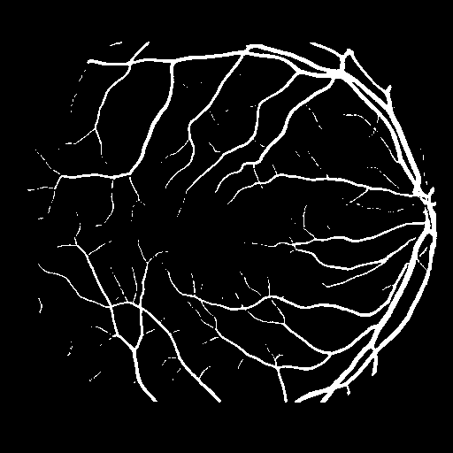
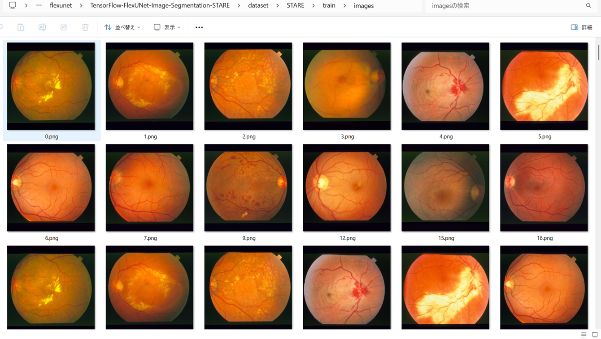
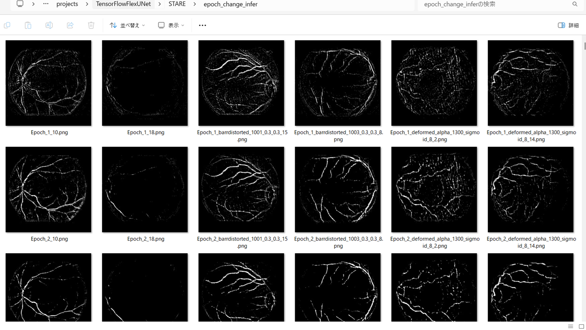
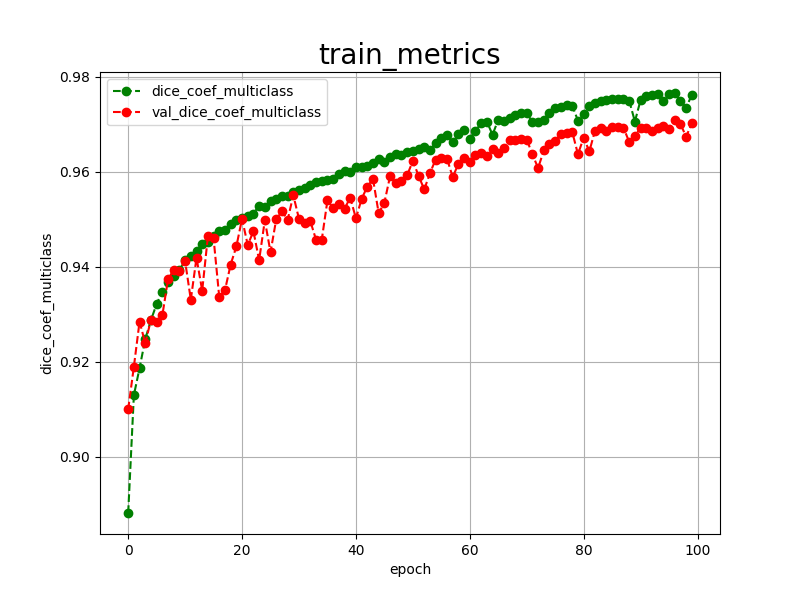
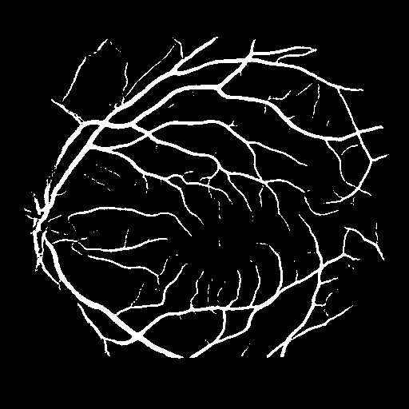

<h2>TensorFlow-FlexUNet-Image-Segmentation-STARE-Retinal-Vessel (2025/07/01)</h2>

This is the first experiment of Image Segmentation for STARE Retinal Vessel 
 based on our TensorFlowFlexUNet (TensorFlow Flexible UNet Image Segmentation Model for Multiclass) 
and, <a href="https://drive.google.com/file/d/1dpyrsehyzNOgRgzv-PmhNAuHjLAoZY-U/view?usp=sharing">
Augmented-STARE-PNG-ImageMask-Dataset.zip</a>, 
which was derived by us from the following images and labels:  
<a href="https://cecas.clemson.edu/~ahoover/stare/probing/stare-images.tar">
<b>
Twenty images used for experiments
</b>
</a>
 
<a href="https://cecas.clemson.edu/~ahoover/stare/probing/labels-ah.tar">
<b>
Hand labeled vessel network provided by Adam Hoover
</b>
</a>
 
 
On detail of <b>STARE(STructured Analysis of the Retina)</b>, 
please refer to the official site: 
<a href="https://cecas.clemson.edu/~ahoover/stare/">
STructured Analysis of the Retina
</a>
, and github repository <a href="https://github.com/openmedlab/Awesome-Medical-Dataset/blob/main/resources/STARE.md">
STARE
</a>
  
As demonstrated in <a href="https://github.com/sarah-antillia/TensorFlow-FlexUNet-Image-Segmentation-ETIS-LaribPolypDB">TensorFlow-FlexUNet-Image-Segmentation-ETIS-LaribPolypDB</a> ,
 our Multiclass TensorFlowFlexUNet, which uses categorized masks, can also be applied to 
single-class image segmentation models. 
This is because it inherently treats the background as one category and your single-class mask data as 
a second category. In essence, your single-class segmentation model will operate with two categorized classes within our Multiclass UNet framework.
 
 

<b>Actual Image Segmentation for Images of 512x512 pixels</b> 
As shown below, the inferred masks predicted by our segmentation model trained on the PNG dataset appear 
similar to the ground truth masks, but lack precision in some areas,
especially, failed to detect the thin retinal vessels.  
To improve segmentation accuracy, we could consider using a different segmentation model better suited for this task.
Please see also our experiment 
<a href="https://github.com/sarah-antillia/Tensorflow-Tiled-Image-Segmentation-Pre-Augmented-STARE-Retinal-Vessel">
Tensorflow-Tiled-Image-Segmentation-Pre-Augmented-STARE-Retinal-Vessel
</a>  
<table>
<tr>
<th>Input: image</th>
<th>Mask (ground_truth)</th>
<th>Prediction: inferred_mask</th>
</tr>
<tr>
<td></td>
<td></td>
<td></td>
</tr>

<tr>
<td></td>
<td></td>
<td></td>
</tr>

<tr>
<td></td>
<td></td>
<td></td>
</tr>
</table>

 

<h3>1. Dataset Citation</h3>
The dataset used here has been take from 
from the following images and labels
in <a href="https://cecas.clemson.edu/~ahoover/stare/">
STructured Analysis of the Retina
</a>
:  
<a href="https://cecas.clemson.edu/~ahoover/stare/probing/stare-images.tar">
<b>
Twenty images used for experiments
</b>
</a>
 
<a href="https://cecas.clemson.edu/~ahoover/stare/probing/labels-ah.tar">
<b>
Hand labeled vessel network provided by Adam Hoover
</b>
</a>
 
 
Please see also <a href="https://github.com/openmedlab/Awesome-Medical-Dataset/blob/main/resources/STARE.md">
STARE
</a>
 
 
<b>Authors and Institutions</b> 
Adam Hoover (Department of Electrical and Computer Engineering, Clemson University) 
Valentina Kouznetsova (Vision Computing Lab, Department of Electrical and Computer Engineering,  
University of California, San Diego, La Jolla) 
Michael Goldbaum (Department of Ophthalmology, University of California, San Diego)
 
 
<b>Citation</b> 
@ARTICLE{845178, 
  author={Hoover, A.D. and Kouznetsova, V. and Goldbaum, M.}, 
  journal={IEEE Transactions on Medical Imaging},  
  title={Locating blood vessels in retinal images by piecewise threshold probing of a matched filter response},  
  year={2000}, 
  volume={19}, 
  number={3}, 
  pages={203-210}, 
  doi={10.1109/42.845178}} 
  
<h3>
<a id="2">
2 STARE ImageMask Dataset
</a>
</h3>
 If you would like to train this STARE Segmentation model by yourself,
 please download the dataset from the google drive  
<a href="https://drive.google.com/file/d/1dpyrsehyzNOgRgzv-PmhNAuHjLAoZY-U/view?usp=sharing">
Augmented-STARE-PNG-ImageMask-Dataset.zip</a>
, expand the downloaded ImageMaskDataset and put it under <b>./dataset</b> folder to be
<pre>
./dataset
└─STARE
    ├─test
    │   ├─images
    │   └─masks
    ├─train
    │   ├─images
    │   └─masks
    └─valid
        ├─images
        └─masks
</pre>
 
 
<b>STARE Statistics</b> 
 
 
As shown above, the number of images of train and valid datasets is not enough to use for a training set of our segmentation model.

 
 
<b>Train_images_sample</b> 

 
<b>Train_masks_sample</b> 

 

<h3>
3 Train TensorflowUNet Model
</h3>
 We have trained STARETensorflowUNet Model by using the following
<a href="./projects/TensorFlowFlexUNet/STARE/train_eval_infer.config"> <b>train_eval_infer.config</b></a> file.  
Please move to ./projects/TensorFlowFlexUNet/STAREand run the following bat file. 
<pre>
>1.train.bat
</pre>
, which simply runs the following command. 
<pre>
>python ../../../src/TensorflowFlexUNetTrainer.py ./train_eval_infer.config
</pre>

<b>Model parameters</b> 
Defined a small <b>base_filters</b> and large <b>base_kernels</b> for the first Conv Layer of Encoder Block of 
<a href="./src/TensorflowFlexUNet.py">TensorflowFlesUNet.py</a> 
and a large num_layers (including a bridge between Encoder and Decoder Blocks).
<pre>
[model]
base_filters   = 16
base_kernels   = (9,9)
num_layers     = 8
num_classes    = 2

dilation       = (3,3)
</pre>

<b>Learning rate</b> 
Defined a very small learning rate.  
<pre>
[model]
learning_rate  = 0.00007
</pre>

<b>Online augmentation</b> 
Disabled our online augmentation.You may train this model by setting this generator parameter to True. 
<pre>
[model]
model         = "TensorflowUNet"
generator     = False
</pre>

<b>Loss and metrics functions</b> 
Specified "categorical_crossentropy" and <a href="./src/dice_coef_multiclass.py">"dice_coef_multiclass"</a>. 
<pre>
[model]
loss           = "categorical_crossentropy"
metrics        = ["dice_coef_multiclass"]
</pre>
<b>Learning rate reducer callback</b> 
Enabled learing_rate_reducer callback, and a small reducer_patience.
<pre> 
[train]
learning_rate_reducer = True
reducer_factor     = 0.4
reducer_patience   = 4
</pre>

<b>Early stopping callback</b> 
Enabled early stopping callback with patience parameter.
<pre>
[train]
patience      = 10
</pre>
<b>Mask RGB_map</b> 
[mask]
<pre>
mask_datatype    = "categorized"
mask_file_format = ".png"
;STARErgb color map dict for 1+1 classes.
;Background:black, Vessel:white
rgb_map = {(0,0,0):0,(255, 255, 255):1, }
</pre>
<b>Epoch change inference callbacks</b> 
Enabled epoch_change_infer callback. 
<pre>
[train]
epoch_change_infer       = True
epoch_change_infer_dir   =  "./epoch_change_infer"
epoch_changeinfer        = False
epoch_changeinfer_dir    = "./epoch_changeinfer"
num_infer_images         = 6
</pre>

By using this callback, on every epoch_change, the inference procedure can be called
 for 6 images in <b>mini_test</b> folder. This will help you confirm how the predicted mask changes 
 at each epoch during your training process.    

<b>Epoch_change_inference output at starting (epoch 1,2,3)</b> 
 
 

<b>Epoch_change_inference output at middlepoint (epoch 44,45,46)</b> 
 
 
<b>Epoch_change_inference output at ending (epoch 89,90,91)</b> 
 
 

In this experiment, the training process was stopped at epoch 91 by EarlyStopping callback.  
 
 

<a href="./projects/TensorFlowFlexUNet/STARE/eval/train_metrics.csv">train_metrics.csv</a> 
 

 
<a href="./projects/TensorFlowFlexUNet/STARE/eval/train_losses.csv">train_losses.csv</a> 
 

 

<h3>
4 Evaluation
</h3>
Please move to a <b>./projects/TensorFlowFlexUNet/STARE</b> folder, 
and run the following bat file to evaluate TensorflowUNet model for STARE. 
<pre>
./2.evaluate.bat
</pre>
This bat file simply runs the following command.
<pre>
python ../../../src/TensorflowFlexUNetEvaluator.py ./train_eval_infer_aug.config
</pre>

Evaluation console output: 

  Image-Segmentation-STARE

<a href="./projects/TensorFlowFlexUNet/STARE/evaluation.csv">evaluation.csv</a> 

The loss (bce_dice_loss) to this STARE/test was very low, and dice_coef very high as shown below.
 
<pre>
ategorical_crossentropy,0.0683
dice_coef_multiclass,0.9677
</pre>
 

<h3>
5 Inference
</h3>
Please move to a <b>./projects/TensorFlowFlexUNet/STARE</b> folder 
,and run the following bat file to infer segmentation regions for images by the Trained-TensorflowUNet model for STARE. 
<pre>
./3.infer.bat
</pre>
This simply runs the following command.
<pre>
python ../../../src/TensorflowFlexUNetInferencer.py ./train_eval_infer_aug.config
</pre>

<b>mini_test_images</b> 
 
<b>mini_test_mask(ground_truth)</b> 
 

<b>Inferred test masks</b> 
 
 

<b>Enlarged images and masks </b> 

<table>
<tr>
<th>Image</th>b
<th>Mask (ground_truth)</th>
<th>Inferred-mask</th>
</tr>

<tr>
<td></td>
<td></td>
<td></td>
</tr>

<tr>
<td></td>
<td></td>
<td></td>
</tr>

<tr>
<td></td>
<td></td>
<td></td>
</tr>

<tr>
<td></td>
<td></td>
<td></td>
</tr>
<tr>
<td></td>
<td></td>
<td></td>
</tr>
<tr>
<td></td>
<td></td>
<td></td>
</tr>
</table>

 

<h3>
References
</h3>
<b>1. Locating Blood Vessels in Retinal Images</b> 
by Piecewise Threshold Probing of a 
Matched Filter Response 
Adam Hoover, Valentina Kouznetsova, and Michael Goldbaum 

<a href="https://www.uhu.es/retinopathy/General/000301IEEETransMedImag.pdf">
https://www.uhu.es/retinopathy/General/000301IEEETransMedImag.pdf
</a>
 
 
<b>2. STructured Analysis of the Retina</b> 
<a href="https://cecas.clemson.edu/~ahoover/stare/">https://cecas.clemson.edu/~ahoover/stare/
</a>
 
 
<b>3. STARE</b> 
<a href="https://github.com/openmedlab/Awesome-Medical-Dataset/blob/main/resources/STARE.md">
https://github.com/openmedlab/Awesome-Medical-Dataset/blob/main/resources/STARE.md
</a>
 
 
<b>4. State-of-the-art retinal vessel segmentation with minimalistic models</b> 
Adrian Galdran, André Anjos, José Dolz, Hadi Chakor, Hervé Lombaert & Ismail Ben Ayed 
<a href="https://www.nature.com/articles/s41598-022-09675-y">
https://www.nature.com/articles/s41598-022-09675-y
</a>
 
 
<b>5. Retinal blood vessel segmentation using a deep learning method based on modified U-NET model</b> 
Sanjeewani, Arun Kumar Yadav, Mohd Akbar, Mohit Kumar, Divakar Yadav 
<a href="https://www.semanticscholar.org/reader/f5cb3b1c69a2a7e97d1935be9d706017af8cc1a3">
https://www.semanticscholar.org/reader/f5cb3b1c69a2a7e97d1935be9d706017af8cc1a3</a>
 
 

<b>6, Tensorflow-Image-Segmentation-Retinal-Vessel</b> 
Toshiyuki Arai @antillia.com 
<a href="https://github.com/sarah-antillia/Tensorflow-Image-Segmentation-Retinal-Vessel">
https://github.com/sarah-antillia/Tensorflow-Image-Segmentation-Retinal-Vessel</a>
 
 
<b>7. Tensorflow-Tiled-Image-Segmentation-Pre-Augmented-STARE-Retinal-Vessel</b> 
Toshiyuki Arai @antillia.com 
<a href="https://github.com/sarah-antillia/Tensorflow-Tiled-Image-Segmentation-Pre-Augmented-STARE-Retinal-Vessel">
https://github.com/sarah-antillia/Tensorflow-Tiled-Image-Segmentation-Pre-Augmented-STARE-Retinal-Vessel
</a>
 

